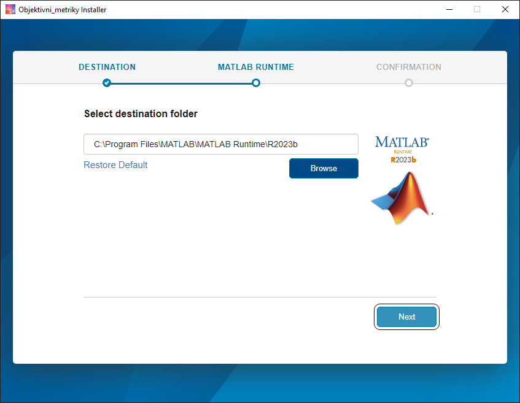

<!-- prevent jekyll yaml parsing -->

  **Vysoké učení technické v Brně, Fakulta elektrotechniky a komunikačních technologií, Ústav radioelektroniky**  

---

# Bakalářská práce: Laboratorní úloha pro hodnocení vizuální kvality komprimovaných obrazů pomocí objektivních a subjektivních metrik

Tento repozitář obsahuje veškeré zdrojové kódy, instalační balíčky, materiály a naměřená data z praktické části bakalářské práce zaměřené na hodnocení kvality obrazu pomocí objektivních a subjektivních metrik. Cílem repozitáře je zajistit plnou reprodukovatelnost dosažených výsledků a usnadnit případný další vývoj.

Autor: Daniel Kroužil  
Akademický rok: 2025/2026  
Licence: MIT  

## Obsah repozitáře
- **[Zdrojové kódy](https://github.com/256-514/Bc-Image-Quality-Analyzer/releases/tag/v1.1)**: MATLAB skripty pro obě vytvořené aplikace (vyvinuto v prostředí MATLAB R2023b).
- **[Instalační balíčky](https://github.com/256-514/Bc-Image-Quality-Analyzer/releases/tag/v1.1)**: Zkompilované verze aplikací připravené pro běžné uživatele.
- **[Výsledky subjektivních testů](https://github.com/256-514/Bc-Image-Quality-Analyzer/raw/refs/heads/main/Vysledky_Subjektivniho_Testovani.xlsx)**: Tabulka s hodnocením od 26 respondentů získaným prostřednictvím Google Forms.

---

## Popis aplikací
- **Objektivní metriky** – aplikace zaměřená na automatizovanou komprimaci obrazu vybranými kodeky a následný výpočet objektivních metrik kvality.
- **Subjektivní testy** – aplikace sloužící pro uživatelské hodnocení vizuální kvality komprimovaných obrazů.

---

## Instalace a první spuštění aplikací
Pro běžné používání aplikací **není vyžadována** instalace plného programu MATLAB.
- Stáhněte si [instalační balíčky](https://github.com/256-514/Bc-Image-Quality-Analyzer/releases/tag/v1.1) *(.exe)*.
- Spusťte instalátor a zvolte složku, kam se má aplikace nainstalovat. Pro běh aplikace postačí samostatné prostředí MATLAB Runtime. Toto prostředí je součástí instalačního balíčku a v případě potřeby se nainstaluje automaticky.

 
Obr. 1 Instalace MATLAB Runtime

> [!IMPORTANT]   
> Při úplně prvním spuštění nainstalované aplikace je vyžadováno připojení k internetu. Aplikace si automaticky stáhne nezbytné [doplňkové knihovny](https://github.com/256-514/Bc-Image-Quality-Analyzer/releases/tag/v1.0) pro práci s multimédii (FFmpeg a heif-enc). Velikost stahovaných dat je přibližně 100 MB.

Obr. 2 Stahování doplňkových knihoven

---

## Licence a použité knihovny
Tento repozitář je vydán pod licencí MIT.

Součástí projektu jsou také externí knihovny třetích stran, které jsou použity v souladu s jejich vlastními licenčními podmínkami:
- **[FFmpeg](https://github.com/BtbN/FFmpeg-Builds)** – použito pro převod komprimovaných obrazů do PNG formátu při práci s kodeky, které MATLAB nenačte přímo. FFmpeg je licencován pod LGPL v2.1+.
- **[heif-enc / libheif](https://github.com/pphh77/libheif-Windowsbinary/)** – použito pro kompresi do formátu HEIC. Tento nástroj je součástí distribuovaných doplňkových knihoven aplikace a je použit v souladu s licenčními podmínkami příslušné knihovny.
- **[matlabPyrTools](https://github.com/baidut/matLIVE)** – knihovna pro vícestupňové obrazové transformace; použita pro výpočet metriky VIF. Projekt je dostupný na GitHubu a je licencován pod MIT licencí.

Při použití těchto knihoven jsou zachovány jejich původní licence a copyright notice. Kompletní přehled třetích stran je uveden také v příslušných zdrojových souborech.

---

## Prohlášení o využití generativní umělé inteligence
Při zpracování této bakalářské práce byly nástroje generativní umělé inteligence využity výhradně jako konzultační a asistenční prostředek, a to v souladu se směrnicemi VUT.

AI nástroje byly používány výhradně pro:
- jazykové korektury a stylistické úpravy textu,
- refaktorizace zdrojových kódů,
- konzultace při sestavení zdrojových kódů do samostatně spustitelných distribučních balíčků a strukturování GitHub repozitáře.

Veškerá inženýrská rozhodnutí, návrh měřicí metodiky, výběr použitých objektivních a subjektivních metrik, vytvoření datasetu, realizace subjektivního testování, jakož i finální analýza a interpretace naměřených dat, jsou výhradně samostatným dílem autora práce.

---
